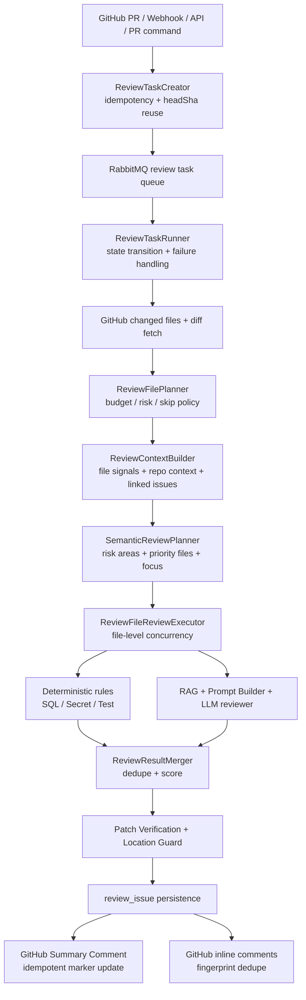

# CodePilot AI

> 面向 GitHub Pull Request 的 Java AI Review 后端系统。
> 它把 PR 审查做成一条可异步调度、可并发执行、可验证证据、可回写 GitHub 的工程流水线，而不是一次简单的 LLM 调用。

GitHub: https://github.com/liche719/codeAireview

## 项目定位

CodePilot AI 是一个面向 Java / Spring Boot 团队的智能 PR 审查系统。系统接收 GitHub Webhook、手动 API 或 PR 评论命令，把一次 PR 审查转成可追踪的 `review_task`，再通过 RabbitMQ 异步消费、Redis 去重、PostgreSQL/pgvector 规则召回、确定性规则检测、LLM 结构化审查、patch 证据校验和 GitHub 评论回写完成闭环。

简历里可以概括为：

> 设计并实现 GitHub PR AI Review 后端系统，将 PR 审查从单次 LLM 调用升级为“Webhook 触发 + RabbitMQ 异步任务 + 文件级并发审查 + RAG 规则召回 + 确定性规则检测 + Patch Verification + GitHub 评论回写”的工程化流水线。

## 为什么不是普通 prompt wrapper

- 多入口触发：支持 `POST /api/reviews`、GitHub PR Webhook、PR 评论 `/review` 和 `@x-pilotx review/fix/chat` 命令。
- 异步执行：Webhook/API 只创建任务并投递 RabbitMQ，耗时审查由消费者执行，避免请求线程阻塞。
- 并发审查：任务内按文件规划审查顺序，并通过 `reviewFileExecutor` 控制文件级并行度。
- 规则优先：SQL 风险、敏感信息、测试缺失等确定性规则在 LLM 前执行，不依赖模型“主动想起”。
- RAG 约束：团队规范进入 pgvector 规则库，按 PR 上下文召回后注入 prompt。
- 证据过滤：LLM 输出必须尽量绑定 changed line、patch token 或 review plan risk，降低空泛评论。
- GitHub 落地：结果会入库，并回写 PR Summary Comment 或 inline comment，评论带 marker/指纹去重。
- 安全边界：API Key、固定窗口限流、Webhook HMAC、仓库 allowlist、GitHub App/PAT 双鉴权、fix 命令白名单和 Docker sandbox 都有实现。

## 核心架构



更详细的模块说明见 [docs/architecture.md](docs/architecture.md)。

## 关键能力

### 1. 异步任务与并发审查

- RabbitMQ 队列：`codepilot.review.task.queue`、`codepilot.pr.command.task.queue`。
- 死信队列：`codepilot.review.task.dlq`、`codepilot.pr.command.task.dlq`。
- Listener 并发：`CODEPILOT_RABBITMQ_LISTENER_CONCURRENCY` / `CODEPILOT_RABBITMQ_LISTENER_MAX_CONCURRENCY`。
- 文件级并行：`CODEPILOT_REVIEW_MAX_PARALLEL_FILES` 控制单个 PR 内最多并发审查文件数。
- 单文件失败隔离：某个文件审查失败时生成系统 issue，其他文件继续审查。

### 2. RAG + 确定性规则 + LLM

- 规则文档通过 `/api/rules` 创建，`/api/rules/{id}/index` 切片并向量化。
- RAG 召回支持 TTL + LRU 缓存，避免同类审查重复查询。
- SQL 风险、Secret 扫描、测试建议是确定性工具，先于 LLM 执行。
- LLM 输出走结构化 schema 和 parser 校验，异常时降级而不是让任务直接失控。

### 3. GitHub 集成

- Webhook 支持 `pull_request` 的 `opened`、`synchronize`、`reopened`。
- `issue_comment` 支持 PR Conversation 中的命令：

```text
/review
@x-pilotx review
@x-pilotx fix dry-run
@x-pilotx fix
```

- 支持 PAT 和 GitHub App 两种鉴权模式，生产推荐 GitHub App。
- Summary Comment 使用 marker 幂等更新，inline comment 使用 fingerprint 去重。
- 可查询 PR closing issues，用于审查上下游上下文。

### 4. 安全与失败处理

- `/api/**` 默认需要 `X-CodePilot-Api-Key`。
- `/api/**` 默认开启固定窗口限流。
- Webhook 使用 `X-Hub-Signature-256` HMAC 校验。
- 生产建议配置 `CODEPILOT_GITHUB_ALLOWED_REPOSITORIES=owner/repo`。
- `@x-pilotx fix` 默认关闭；开启后仍受补丁范围、命令白名单、超时、环境变量隔离和 Docker sandbox 约束。
- GitHub 请求有 rate limit retry/backoff，错误日志会脱敏。

## 技术栈

- Java 21
- Spring Boot 3.5.x
- Spring Web / Validation / AMQP / Redis
- MyBatis Plus
- PostgreSQL + pgvector
- RabbitMQ
- Redis
- LangChain4j
- GitHub REST / GraphQL API
- Flyway
- Docker Compose
- JUnit 5 / Spring Boot Test

## 本地快速启动

### 1. 准备环境

需要：

- JDK 21
- Maven
- Docker Desktop 或 Docker Engine + Compose v2

复制环境变量模板：

```powershell
copy .env.example .env
```

本地最少需要确认：

```env
CODEPILOT_API_AUTH_API_KEY=change-me-local-dev-key
CODEPILOT_DB_URL=jdbc:postgresql://localhost:15432/codepilot
CODEPILOT_DB_USERNAME=codepilot
CODEPILOT_DB_PASSWORD=codepilot123
CODEPILOT_REDIS_HOST=localhost
CODEPILOT_RABBITMQ_HOST=localhost
```

如果要真实调用 GitHub 和 LLM，再补：

```env
CODEPILOT_GITHUB_TOKEN=
CODEPILOT_LLM_API_KEY=
CODEPILOT_EMBEDDING_API_KEY=
CODEPILOT_GITHUB_WEBHOOK_SECRET=
```

完整配置说明见 [docs/env.md](docs/env.md)。

### 2. 启动依赖

```powershell
docker compose up -d
```

本地依赖端口：

- PostgreSQL: `localhost:15432`
- Redis: `localhost:16379`
- RabbitMQ AMQP: `localhost:5672`
- RabbitMQ Management: `http://localhost:15672`

### 3. 启动应用

```powershell
mvn spring-boot:run
```

也可以使用脚本一次性加载 `.env`、启动依赖、打包并运行：

```powershell
powershell -ExecutionPolicy Bypass -File scripts/start-local.ps1
```

### 4. 运行本地 smoke 检查

应用启动后执行：

```powershell
powershell -ExecutionPolicy Bypass -File scripts/smoke-local.ps1
```

这个脚本会检查：

- OpenAPI 是否可访问。
- `/api/**` 无 API Key 是否被拒绝。
- API Key 是否能访问受保护接口。
- 规则文档能否创建和查询。
- 限流响应头是否存在。

详细演示流程见 [docs/demo.md](docs/demo.md)。

## 常用 API

创建审查任务：

```powershell
curl -X POST http://localhost:8080/api/reviews ^
  -H "X-CodePilot-Api-Key: change-me-local-dev-key" ^
  -H "Content-Type: application/json" ^
  -d "{\"prUrl\":\"https://github.com/owner/repo/pull/123\"}"
```

查询任务：

```powershell
curl http://localhost:8080/api/reviews/123 ^
  -H "X-CodePilot-Api-Key: change-me-local-dev-key"
```

查询审查问题：

```powershell
curl http://localhost:8080/api/reviews/123/issues ^
  -H "X-CodePilot-Api-Key: change-me-local-dev-key"
```

创建规则文档：

```powershell
curl -X POST http://localhost:8080/api/rules ^
  -H "X-CodePilot-Api-Key: change-me-local-dev-key" ^
  -H "Content-Type: application/json" ^
  -d "{\"title\":\"MySQL SQL 规范\",\"type\":\"SQL_RULE\",\"source\":\"manual\",\"content\":\"禁止字符串拼接 SQL。UPDATE 和 DELETE 必须带 WHERE。\"}"
```

完整 API 见 [docs/api.md](docs/api.md)。

## 测试与验证

全量测试：

```powershell
mvn test
```

当前基线：

- `509` 个自动化测试通过。
- 离线 AI Review 评估覆盖 SQL 风险、Secret、prompt injection、测试缺失、API 契约变化、配置安全回归、非法 JSON 降级。
- 当前离线评估：Precision `85.71%`，Recall `100%`，must-not-comment violation rate `0%`。

关键专项：

```powershell
mvn "-Dtest=AiReviewPipelineEvalTest,DeterministicReviewEvalTest,PromptRegressionEvalTest" test
powershell -ExecutionPolicy Bypass -File scripts/run-review-reliability-baseline.ps1
```

项目证据链和面试讲法见 [docs/resume-project-evidence.md](docs/resume-project-evidence.md)。

## 代码地图

- 任务入口：`src/main/java/com/codepilot/module/review/controller/ReviewController.java`
- Webhook：`src/main/java/com/codepilot/module/github/webhook/`
- RabbitMQ：`src/main/java/com/codepilot/task/`、`src/main/java/com/codepilot/common/config/RabbitMqConfig.java`
- 审查 Runner：`src/main/java/com/codepilot/module/review/runner/ReviewTaskRunner.java`
- 审查执行：`src/main/java/com/codepilot/module/review/processor/`
- 审查规划：`src/main/java/com/codepilot/module/review/planner/`
- 上下文构建：`src/main/java/com/codepilot/module/review/context/`
- RAG：`src/main/java/com/codepilot/module/rag/`
- LLM/Agent：`src/main/java/com/codepilot/module/agent/`
- GitHub 客户端与鉴权：`src/main/java/com/codepilot/module/git/`
- PR 命令和自动修复：`src/main/java/com/codepilot/module/command/`
- 安全过滤器：`src/main/java/com/codepilot/common/security/`
- 数据库迁移：`src/main/resources/db/migration/`

## 文档

- [架构说明](docs/architecture.md)
- [API 文档](docs/api.md)
- [本地演示流程](docs/demo.md)
- [环境变量](docs/env.md)
- [GitHub 鉴权模式](docs/github-auth.md)
- [Docker 部署](docs/docker-deploy.md)
- [GitHub sandbox E2E](docs/github-sandbox-e2e.md)
- [简历证据链与面试讲法](docs/resume-project-evidence.md)

## 一句话总结

CodePilot AI 的核心价值是：把 AI Code Review 从“模型生成一段评论”升级成“可调度、可并发、可验证、可追踪、可回写 GitHub 的后端审查流水线”。
