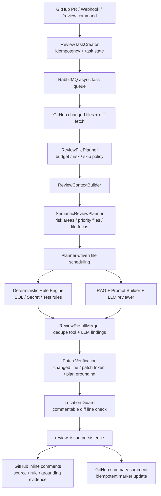

# CodePilot AI

> 面向 GitHub Pull Request 的 Java AI Review 系统。
> 它把 PR 审查做成一条可异步调度、可验证、可回写的工程流水线，而不是一次性的 LLM 调用。

## 项目定位

CodePilot AI 是一个面向 Java / Spring Boot 后端团队的 GitHub PR 自动审查系统。它把 webhook、RabbitMQ、RAG、确定性规则、Semantic Review Planning、Patch Verification 和 GitHub 评论回写串成完整链路，让“发现问题”变成一条可执行、可追溯、可落地的审查工作流。

## 为什么值得看

- 不是 prompt wrapper：系统先做任务编排、文件预算、风险分层和审查焦点规划，再把受约束的上下文交给 LLM。
- 不是单次 diff -> LLM：审查结果会和确定性工具、RAG 规则、patch 校验结果合并。
- 不是只会吐文本：最终 issue 会落库，并回写到 GitHub PR 顶部评论或 inline comment。
- 工程边界清晰：Webhook、任务队列、AI 层、评论发布、数据库各自解耦。

## 我做了什么

- 任务编排：`ReviewTaskServiceImpl` 创建任务，`ReviewTaskRunner` 负责 head sha 去重和状态流转，RabbitMQ 负责异步消费。
- 上下文构建：`ReviewContextBuilder` 聚合 file summary、语义信号、关系信号、相关 patch 和仓库代码片段。
- 审查规划：`ReviewFilePlanner` 和 `SemanticReviewPlanner` 会按文件预算、路径风险和语义风险分配审查焦点。
- 审查执行：确定性工具先跑 SQL 风险、敏感信息、测试建议，再由 LangChain4j `@AiService` 产出结构化审查结果。
- 证据约束：`ReviewIssuePatchVerifier` 和 Location Guard 让 issue 尽量绑定 changed line、patch token 或审查计划风险面。
- 回写发布：审查问题入库到 `review_issue`，并回写 GitHub Summary Comment、inline comment，外加 PR 关联 Issue 查询。

## 核心能力

- 手动 `POST /api/reviews` 创建 PR 审查任务。
- GitHub Webhook 自动触发 `opened`、`synchronize`、`reopened` 的 PR 审查。
- PR 评论区输入 `/review` 可手动触发一次审查。
- 支持对话型 `chat` 能力，用于解释 PR、总结变更或回答简短问题。
- 支持 `@x-pilotx review`、`@x-pilotx fix dry-run`、`@x-pilotx fix` 等 PR 评论命令代理。
- RabbitMQ 异步消费审查任务，避免接口阻塞。
- GitHub API 拉取 PR changed files、diff、评论和 PR 详情。
- PostgreSQL + pgvector 存储规则文档和向量块，供 RAG 检索使用。
- SQL 风险、敏感信息、单测建议等确定性检测会在 LLM 之前执行。
- 审查问题入库到 `review_issue`，并回写 GitHub Summary Comment 或 inline review comment。
- 可查询 PR 关联 Issue，用于展示 PR 上下游背景。

## 你可以把它理解成

```text
不是纯 LLM 聊天机器人
不是简单的 diff->prompt->response 包装器
而是一个带审查计划、规则引擎、Patch Verification 和 GitHub 证据回写的 AI Review Pipeline
```

## 核心架构图

CodePilot AI 的核心不是把 diff 直接扔给大模型，而是先用确定性上下文和规则系统把 PR 拆成可审查、可排序、可验证的 review task，再让 LLM 处理被约束后的问题空间。



更详细的模块说明见 [docs/architecture.md](docs/architecture.md)。

## Review Pipeline 示例

假设一个 PR 同时修改 `README.md` 和 `src/main/resources/mapper/UserMapper.xml`：

1. `ReviewFilePlanner` 会先按文件预算和路径风险筛掉不适合审查的超大文件或低价值文件。
2. `SemanticReviewPlanner` 会识别 `UserMapper.xml` 属于 database / SQL 风险面，生成 `ReviewPlan.priorityFiles`，并把它排到 `README.md` 之前审查。
3. `AiReviewContextFormatter` 不会把同一份大上下文无差别塞给每个文件，而是为当前文件注入 file-specific focus，例如 SQL 注入、`SELECT *`、无 WHERE 更新、迁移回滚等。
4. `DeterministicReviewToolRunner` 通过可插拔 `DeterministicReviewRule` 执行 SQL 风险、Secret 扫描、测试缺失建议等规则；单个规则失败不会拖垮整个 review。
5. LLM 输出的 issue 必须经过 `ReviewIssuePatchVerifier` 校验，只有能绑定到 changed line、patch token、semantic review plan risk 或高信号风险面的评论才会被保留。
6. GitHub inline / summary comment 会展示 `source / rule / grounding`，例如 `source=LLM, rule=SECURITY_RULE, grounding=changed diff line`，避免用户看不出评论依据。

这条链路让系统从简单的 LLM comment generator 升级为一个带 planner、deterministic rules、patch-grounded verification 和 GitHub 证据回写的 AI Review Pipeline。

## 项目亮点

- 把 PR 审查做成完整工程闭环，而不是单次 LLM 调用。
- 使用 RabbitMQ 解耦审查耗时逻辑。
- 使用 pgvector 做规则库检索。
- 使用 LangChain4j `@AiService`，并把确定性工具结果与模型审查结果合并，降低工具漏跑风险。
- 支持 Webhook 自动触发，适合真实 GitHub 工作流。
- 支持 PR 评论区 `/review` 手动触发，适合需要临时复审的场景。
- 支持 GitHub 评论回写，审查结果能直接落到 PR 页面。
- 顶部 Summary Comment 幂等更新，inline comment 可按配置开启。
- 支持查询 PR 关联 Issue，能补足审查时的上下游背景。

## 技术栈

- Spring Boot 3.5.x
- Spring Web
- Spring Validation
- MyBatis Plus
- PostgreSQL
- pgvector
- Redis
- RabbitMQ
- LangChain4j
- GitHub REST API
- Springdoc OpenAPI
- Docker Compose

## GitHub 集成

### Webhook

在 GitHub 仓库的 `Settings -> Webhooks` 中新增 Webhook：

- Payload URL: `https://your-domain/api/github/webhook`
- Content type: `application/json`
- Secret: 与 `CODEPILOT_GITHUB_WEBHOOK_SECRET` 保持一致
- Events: `Pull requests`、`Issue comments`

支持的 PR 事件：

- `opened`
- `synchronize`
- `reopened`

`Pull requests` 用于 PR 打开、更新、重新打开时自动审查；`Issue comments` 用于在 PR Conversation 中输入 `/review` 手动触发审查。普通 issue 评论、非 `/review` 内容和非 `created` 评论事件会被忽略。

### PR 评论命令代理

PR 评论支持以下命令：

```text
/review
@x-pilotx review
@x-pilotx fix dry-run
@x-pilotx fix
```

`@x-pilotx review` 会复用普通审查流水线，并更新带 marker 的 PR 总结评论；如果 marker 评论不存在才会创建新评论。`@x-pilotx fix dry-run` 会生成并校验一个小型 unified diff，但不会推送提交。`@x-pilotx fix` 会使用与当前 PR head sha 匹配的最近一次成功审查结果，在临时检出目录中应用补丁，运行校验命令，通过后才向当前 PR 分支推送新提交。

Fix 模式默认关闭。若要开启，请设置 `CODEPILOT_GITHUB_FIX_ENABLED=true`。它只会写回同仓库的 PR 分支，token 仍需要 `Contents: Read and write`、`Pull requests: Read and write`、`Issues: Read and write` 和 `Metadata: Read`。

PR 评论命令默认只允许 GitHub `author_association` 为 `OWNER`、`MEMBER` 或 `COLLABORATOR` 的评论者触发。若确需调整，请设置 `CODEPILOT_GITHUB_ALLOWED_COMMENT_AUTHOR_ASSOCIATIONS`。

如果服务面向多个仓库或暴露到公网，建议设置 `CODEPILOT_GITHUB_ALLOWED_REPOSITORIES=owner/repo`。该 allowlist 会同时限制手动 `/api/reviews`、PR Webhook 自动审查和 PR 评论命令，未在列表内的仓库不会创建审查任务，也不会执行 `review/fix/chat` 命令。

### PR 关联 Issue

```bash
curl http://localhost:8080/api/reviews/123/linked-issues ^
  -H "X-CodePilot-Api-Key: change-me-local-dev-key"
```

这个接口会返回 PR 关联的 issue 列表，适合在 PR 审查和评论机器人里展示上下游背景。

## 本地启动

### 1. 准备环境变量

复制模板：

```powershell
copy .env.example .env
```

编辑 `.env`，至少填写：

- `CODEPILOT_API_AUTH_API_KEY`
- `CODEPILOT_GITHUB_TOKEN`
- `CODEPILOT_LLM_API_KEY`
- `CODEPILOT_EMBEDDING_API_KEY`
- `CODEPILOT_GITHUB_WEBHOOK_SECRET`

更完整说明见 [docs/env.md](docs/env.md)。

### 2. 启动本地依赖和应用

```powershell
powershell -ExecutionPolicy Bypass -File scripts/start-local.ps1
```

脚本会：

1. 检查 `.env` 是否存在；
2. 加载 `.env` 到当前进程；
3. 启动 Docker 依赖；
4. 执行 `mvn -DskipTests package`；
5. 启动应用 jar。

### 3. 常用地址

- OpenAPI: `http://localhost:8080/doc.html`
- Swagger UI: `http://localhost:8080/swagger-ui/index.html`

## API 使用示例

### 创建审查任务

```bash
curl -X POST http://localhost:8080/api/reviews ^
  -H "X-CodePilot-Api-Key: change-me-local-dev-key" ^
  -H "Content-Type: application/json" ^
  -d "{\"prUrl\":\"https://github.com/owner/repo/pull/123\"}"
```

### 查询任务详情

```bash
curl http://localhost:8080/api/reviews/123 ^
  -H "X-CodePilot-Api-Key: change-me-local-dev-key"
```

### 查询审查问题

```bash
curl http://localhost:8080/api/reviews/123/issues ^
  -H "X-CodePilot-Api-Key: change-me-local-dev-key"
```

### 创建规则文档

```bash
curl -X POST http://localhost:8080/api/rules ^
  -H "X-CodePilot-Api-Key: change-me-local-dev-key" ^
  -H "Content-Type: application/json" ^
  -d "{\"title\":\"SQL 规范\",\"content\":\"...\"}"
```

### GitHub Webhook

```bash
curl -X POST http://localhost:8080/api/github/webhook ^
  -H "X-GitHub-Event: pull_request" ^
  -H "X-GitHub-Delivery: demo-1" ^
  -H "X-Hub-Signature-256: sha256=..." ^
  -H "Content-Type: application/json" ^
  -d "{...}"
```

## 工程与安全设计

- Webhook 使用 GitHub HMAC 签名校验。
- 内部 REST API 通过 API Key 和限流保护。
- GitHub 仓库有 allowlist，避免任意仓库触发审查成本。
- prompt 输入会做不可信分隔符转义和敏感信息脱敏。
- Summary Comment 使用 marker 幂等更新，避免重复刷屏。
- inline comment 使用指纹 marker 去重。
- `ReviewIssuePatchVerifier` 和 Location Guard 负责让评论尽量落在可解释、可定位的 diff 行上。

## 文档

- 架构说明: [docs/architecture.md](docs/architecture.md)
- GitHub Auth Modes: [docs/github-auth.md](docs/github-auth.md)
- 环境变量: [docs/env.md](docs/env.md)
- 深度调研报告: [docs/archive/codeAireview-深度调研报告.md](docs/archive/codeAireview-深度调研报告.md)

## 适合简历的一句话

将 PR 审查从“单次 LLM 调用”升级为“Semantic Review Planner + 确定性规则 + Patch Verification + GitHub 证据回写”的工程化流水线。

## 验证

```bash
mvn test
mvn -DskipTests package
```

如果你只想先看效果，建议按下面顺序：

1. 启动 PostgreSQL、Redis、RabbitMQ；
2. 配置 `.env`；
3. 启动应用；
4. 创建规则；
5. 发起 PR 审查；
6. 在 PR 页面查看 CodePilot 评论。
