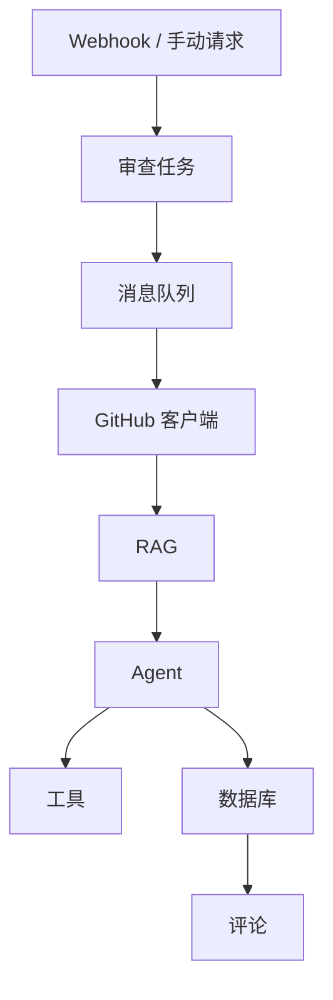

# 架构说明

## 模块划分

### `审查任务`

负责 PR 审查任务的创建、状态流转、文件保存、问题汇总和结果查询。它是手动接口和 Webhook 的统一入口。

### `GitHub 客户端`

负责和 GitHub REST API 交互，包括拉取 PR changed files、查询 PR comments、创建评论和创建审查报告评论。

### `Webhook`

负责接收 GitHub Webhook 事件、验签、解析 payload、做短时间去重，并把有效的 PR 事件转换成审查任务。

### `RAG`

负责规则文档的创建、切片、向量化、检索和上下文组装，为审查过程注入团队规范。

### `Agent`

负责构造 AI Review Prompt、注入 RAG 上下文、调用 LangChain4j `@AiService`，并把模型输出解析成结构化 JSON。

### `工具`

负责 SQL 风险、敏感信息、单测建议等确定性检测。通过 LangChain4j `@Tool` 暴露给模型，由模型自主决定是否调用。

### `评论`

负责把最终审查结果格式化成 Markdown，并创建 GitHub PR 顶部评论。当前策略是追加式：每次审查成功都新建评论，不更新旧评论。

### `消息队列`

负责 RabbitMQ 生产和消费，把耗时审查流程异步化，避免接口线程被阻塞。

### `数据库`

负责持久化 `review_task`、`review_file`、`review_issue`、`rule_document`、`rule_chunk` 等数据，以及审查所需的向量索引和任务状态。

## 典型数据流

## 设计原则

### 1. 控制面和执行面分离

`review task` 和 `webhook` 负责接收请求和调度任务，真正的审查耗时流程由 `mq` 异步执行。

### 2. 模型能力和确定性规则分离

`agent` 负责语言理解和结构化输出，`tool` 负责确定性的规则检测，两者组合后既有灵活性，也有稳定性。

### 3. 规范检索和业务审查解耦

`rag` 只负责召回规则上下文，不直接决定审查结论。最终结论仍由 AI Review Prompt 和工具结果综合生成。

### 4. 评论输出保持可追溯

`comment` 不做旧评论覆盖，而是将新的审查结果追加到 PR 顶部评论中，保留历史轨迹，便于人工复核。

### 5. 数据持久化优先

审查过程中的文件、问题、规则和向量块都落库，方便排查、复现和后续增强分析能力。
