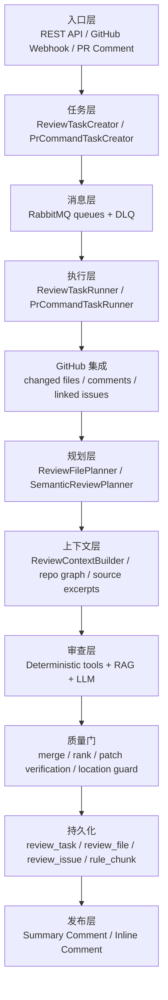
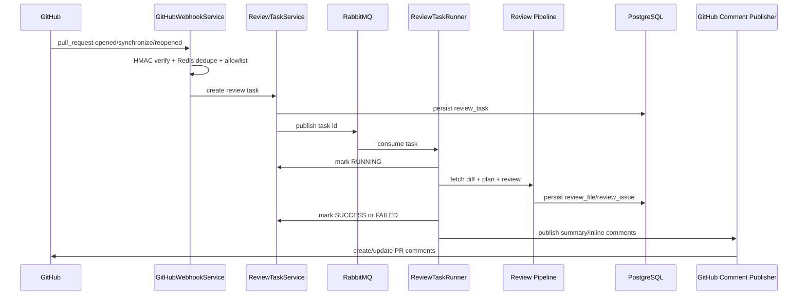

# 架构说明

CodePilot AI 的核心不是把 diff 直接丢给大模型，而是把 PR 审查拆成一条后端流水线：触发、去重、排队、拉取上下文、规划审查重点、并发审查文件、合并结果、证据校验、落库、回写 GitHub。

## 总览



## 模块边界

### 入口层

- `ReviewController` 提供手动创建和查询审查任务的 REST API。
- `GitHubWebhookController` 接收 GitHub Webhook。
- `GitHubWebhookService` 负责开关判断、HMAC 验签、payload 解析、仓库 allowlist、Redis 去重和命令路由。

### 任务层

- `ReviewTaskCreator` 把 PR URL、title、head sha 和评论模式转成 `review_task`。
- `ReviewTaskServiceImpl` 提供创建、查询和处理任务的统一入口。
- `PrCommandTaskCreator` 把 `@x-pilotx fix` 一类 PR 评论命令转成可异步执行的命令任务。

### 消息层

- `ReviewTaskProducer` / `ReviewTaskConsumer` 使用 RabbitMQ 投递和消费审查任务。
- `PrCommandTaskProducer` / `PrCommandTaskConsumer` 使用独立队列处理 PR 命令任务。
- `RabbitMqConfig` 为两类任务都配置 durable queue、direct exchange 和 dead-letter queue。
- Spring AMQP listener 并发由 `CODEPILOT_RABBITMQ_LISTENER_CONCURRENCY`、`CODEPILOT_RABBITMQ_LISTENER_MAX_CONCURRENCY`、`CODEPILOT_RABBITMQ_LISTENER_PREFETCH` 控制。

### 执行层

- `ReviewTaskRunner` 统一推动任务状态：RUNNING -> SUCCESS/FAILED。
- `ReviewTaskProcessor` 负责拉取 changed files、规划文件、清理旧 issue、执行审查并保存结果。
- `ReviewTaskFailureHandler` 统一处理失败、脱敏错误信息，并结合 RabbitMQ retry attempt 判断最终失败。

### 规划和上下文层

- `ReviewFilePlanner` 按文件大小、patch 预算、路径风险和文件类型决定哪些文件进入审查。
- `SemanticReviewPlanner` 汇总风险面，生成 priority files、file focus、cross-file focus 和 verification hints。
- `ReviewContextBuilder` 组合 file summary、语义信号、关联 patch、PR linked issues、仓库图谱和相关源代码片段。
- `RepositoryGraphSnapshotBuilder` 和 `RepoSourceExcerptExtractor` 支持跨文件上下文召回。

### 审查层

- `DeterministicReviewToolRunner` 调用确定性规则工具。
- `SqlRiskTool`、`SecretScanTool`、`TestSuggestionTool` 覆盖 SQL、敏感信息和测试缺失风险。
- `ReviewRagServiceImpl` 召回规则文档，并由 `ReviewRagCache` 做 TTL + LRU 缓存。
- `ReviewPromptBuilder` 和 `AiReviewContextFormatter` 组装受约束的审查 prompt。
- `LangChain4jReviewLlmClient` 调用 OpenAI-compatible 模型。

### 质量门

- `ReviewResultMerger` 合并 deterministic tool 和 LLM 输出。
- `ReviewIssuePatchVerifier` 要求 LLM issue 尽量绑定 changed line、patch token、review plan evidence 或高信号风险面。
- `ReviewIssueLocationGuard` 判断 issue 是否能落到可评论 diff 行。
- `ReviewFindingRanker` 负责评分、去重、预算和发布顺序。

### 发布层

- `ReviewCommentPublisher` 统一发布 GitHub 评论。
- `GitHubCommentServiceImpl` 使用 marker 幂等创建/更新 Summary Comment。
- `GitHubInlineCommentServiceImpl` 使用 issue fingerprint 避免重复 inline comment。
- inline 发布失败或不可定位时，系统仍可通过 Summary Comment 保留审查结果。

## 典型执行链路



## 并发模型

项目有两层并发：

1. 任务级并发：RabbitMQ listener 可以并发消费多个 review task 或 PR command task。
2. 文件级并发：单个 review task 内，`ReviewFileReviewExecutor` 使用 `CompletableFuture` 和 `reviewFileExecutor` 并发审查多个文件。

关键配置：

```env
CODEPILOT_RABBITMQ_LISTENER_CONCURRENCY=2
CODEPILOT_RABBITMQ_LISTENER_MAX_CONCURRENCY=4
CODEPILOT_RABBITMQ_LISTENER_PREFETCH=1
CODEPILOT_REVIEW_MAX_PARALLEL_FILES=2
CODEPILOT_REVIEW_MAX_FILES_PER_TASK=30
```

这样做的目的不是无脑拉高吞吐，而是在 LLM、GitHub API、数据库和队列之间留出可控背压：任务间通过 RabbitMQ 排队，任务内通过文件级并发缩短大 PR 的审查时间。

## 可靠性设计

- Webhook 层使用 Redis 30 秒 TTL 去重，避免 GitHub 重试或重复 delivery 造成重复审查。
- 任务创建层按 repo/pr/headSha/commentMode 复用已有任务，降低重复 LLM 调用成本。
- RabbitMQ retry + DLQ 保存最终失败任务，便于排查。
- 单文件审查失败不会直接拖垮整次 PR 审查。
- GitHub Summary Comment 使用 marker 幂等更新，避免 PR Conversation 被重复刷屏。
- GitHub inline comment 使用 fingerprint 去重。
- LLM cache 和 RAG cache 降低重复审查成本。

## 安全边界

- REST API 默认 API Key 保护。
- REST API 默认固定窗口限流。
- GitHub Webhook 必须 HMAC 验签。
- GitHub 仓库 allowlist 控制可处理范围。
- GitHub App 模式使用短期 installation token，生产优先于 PAT。
- fix 模式默认关闭。
- fix validation 默认只允许 `git diff --check`，不通过 shell 执行命令。
- 构建类命令必须显式开启 Docker sandbox，并且默认无网络、不继承应用敏感环境变量。
- 日志和错误信息会经过敏感信息脱敏。

## 数据模型

核心表：

- `review_task`：一次 PR 审查任务，包含 repo、prNumber、headSha、状态、风险等级和统计信息。
- `review_file`：一次审查中的 changed file 记录。
- `review_issue`：最终审查问题，包含 severity、issueType、filePath、lineNumber、source、ruleCode、evidence 等。
- `rule_document`：规则文档原文。
- `rule_chunk`：规则文档切片和 pgvector embedding。
- `pr_command_task`：PR 评论命令任务。
- `pr_command_task_log`：命令执行日志。
- `ai_review_cache`：LLM 审查缓存。
- `llm_call_log`：LLM 调用审计日志。

数据库迁移位于 `src/main/resources/db/migration/`，由 Flyway 在启动时执行。

## 质量验证

自动化测试覆盖：

- Webhook 验签、payload 解析、事件忽略和去重。
- RabbitMQ 配置、retry attempt 和 DLQ。
- API Key 与限流。
- GitHub Client、GitHub App 鉴权、评论回写和 inline comment 去重。
- RAG 检索、缓存、规则切片和 pgvector 工具。
- SQL/Secret/Test deterministic rules。
- Prompt、parser、LLM schema、降级路径。
- patch verification、location guard、finding ranking。
- 自动修复 patch 应用、命令白名单和 sandbox 约束。

当前全量测试基线：`509 tests, 0 failures, 0 errors, 2 skipped`。
