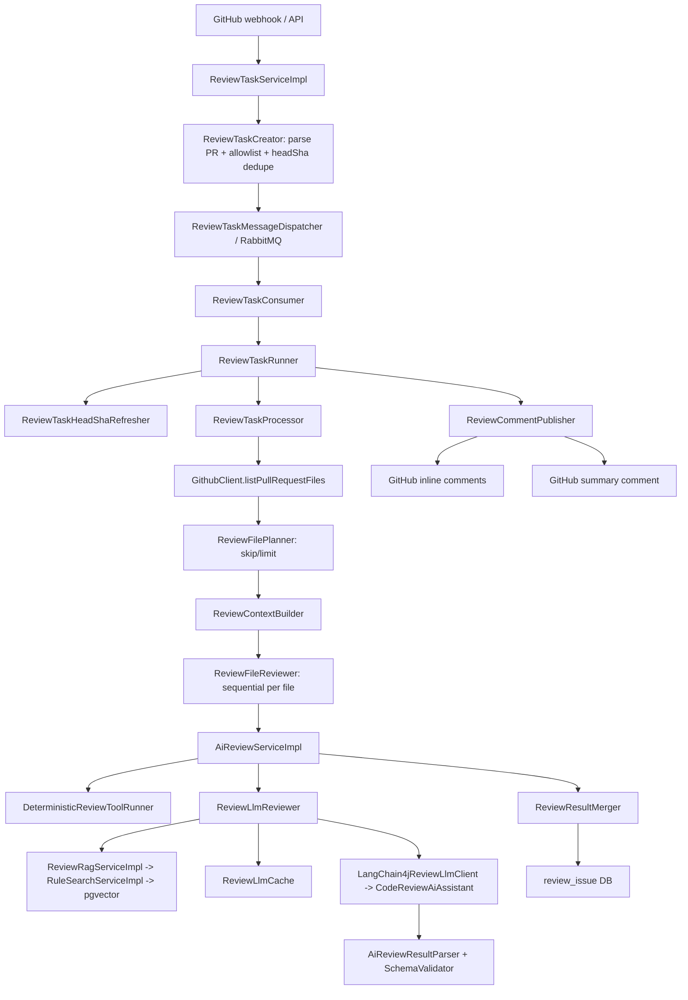
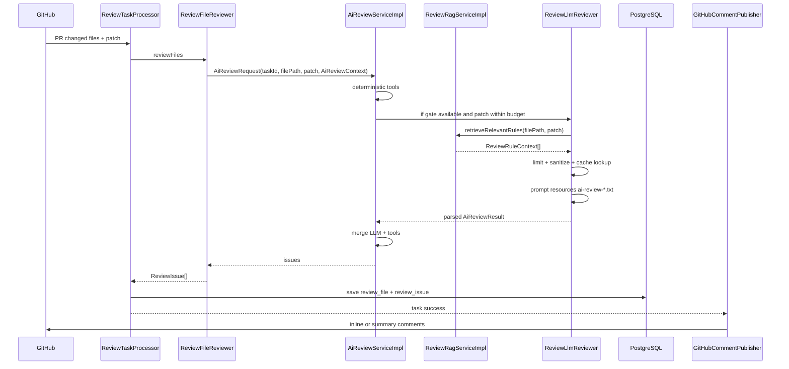
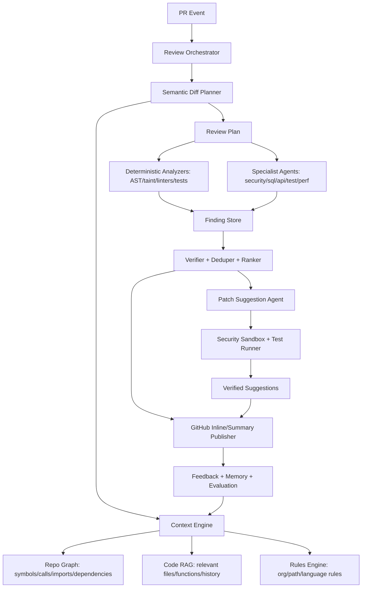

# codeAireview 深度调研报告

生成日期：2026-05-24  
本地仓库：`C:\Users\33721\Desktop\项目\codeAireview`  
审计基线：`git rev-parse --short HEAD = cb9d440`  
工作区状态：仅发现未跟踪文件 `目前问题.md`，本报告未修改业务代码。  
验证命令：`mvn test`，结果 `Tests run: 350, Failures: 0, Errors: 0, Skipped: 1`，`BUILD SUCCESS`。

## 证据标注约定

- **Observed**：本地代码、配置、测试或官方资料直接可证实。
- **Inferred**：基于当前实现推断出的风险，不等同于已发生故障。
- **Unknown**：当前仓库或公开资料无法证实。

---

# 1. 项目一句话本质

**这个项目本质上是一个工程化的 GitHub PR 自动审查机器人：以 GitHub webhook / API 触发，按文件 diff 执行确定性规则、规则 RAG、LLM JSON 审查、数据库落库、GitHub summary/inline comment，并带有受限 auto-fix 流程。**

- **Observed：当前真正核心能力**：PR 文件抓取、任务队列、任务去重、review 文件规划、确定性工具、规则 RAG、LLM 审查、结果 schema 校验、审查缓存、审计日志、GitHub 评论、`@x-pilotx` 命令、受限自动修复链路已经存在。证据：`ReviewTaskServiceImpl.createTask/processTask`，`ReviewTaskRunner.run`，`ReviewTaskProcessor.process`，`AiReviewServiceImpl.reviewFile`，`ReviewLlmReviewer.review`，`GitHubWebhookService.handle`，`GitHubInlineCommentServiceImpl.commentInlineIssues`，`PrCommandTaskRunner.run`。
- **Observed：当前最大短板**：没有真正的 repo intelligence。上下文主要来自当前 PR 文件列表、patch 统计、规则库检索和启发式信号，不存在代码库级 symbol graph、call graph、dependency graph、跨文件语义索引、历史 PR 记忆或 patch verification agent。
- **Inferred：当前技术路线的问题**：它已经超过简单 prompt wrapper，但 AI 能力上限仍被“按文件 diff + 规则 RAG + 单轮 LLM JSON”锁死。继续堆 prompt、规则和正则会提高局部命中率，但不会自然长出跨模块因果理解。

---

# 2. 架构级分析

## 2.0 系统架构流



## 2.1 PR Review 生命周期

1. **触发**：`ReviewController.createReview` 通过 `/api/reviews` 创建任务，或 `GitHubWebhookService.handle` 接收 `pull_request` / `issue_comment` 事件。
2. **建任务与去重**：`ReviewTaskCreator.create` 解析 PR URL，校验仓库 allowlist，按 `repo_owner + repo_name + pr_number + head_sha + review_comment_mode` 查找可复用任务。
3. **异步执行**：`ReviewTaskServiceImpl.createTask` 在事务提交后发送消息，`ReviewTaskConsumer` 调 `processTask`。
4. **拉取 diff**：`ReviewTaskProcessor.process` 调 `GithubClient.listPullRequestFiles` 拉取文件列表。
5. **规划文件**：`ReviewFilePlanner.plan` 跳过空 patch、二进制/超大/生成产物/超过限制的文件。
6. **构造上下文**：`ReviewContextBuilder.build` 汇总文件列表、跳过文件、增删行、patch 长度、启发式 signals。
7. **逐文件审查**：`ReviewFileReviewer.review` 顺序遍历每个可审文件，调用 `AiReviewServiceImpl.reviewFile`。
8. **工具 + LLM**：先跑 deterministic tools，再根据 `ReviewLlmGate` 与输入预算决定是否跑 LLM。LLM 前取规则 RAG、做输入截断、查缓存、调用模型、解析 JSON。
9. **落库**：`ReviewTaskProcessor` 替换 `review_file`、清空并保存 `review_issue`。
10. **评论发布**：`ReviewCommentPublisher` 按 `ReviewCommentMode` 发 inline comment，失败或无 inline 成功时 fallback 到 summary comment。

## 2.2 Diff -> Prompt -> LLM -> Parser -> DB -> GitHub Comment 链路



## 2.3 架构优点

- **Observed：主链路已经拆出阶段边界**。`ReviewTaskServiceImpl` 只负责创建/处理入口，`ReviewTaskRunner` 负责生命周期，`ReviewTaskProcessor` 负责拉文件和落库，`ReviewFileReviewer` 负责逐文件 review，`ReviewCommentPublisher` 负责发布评论。证据：`src/main/java/com/codepilot/module/review/service/impl/ReviewTaskServiceImpl.java:48-62`，`src/main/java/com/codepilot/module/review/runner/ReviewTaskRunner.java:30-50`，`src/main/java/com/codepilot/module/review/processor/ReviewTaskProcessor.java:33-50`。
- **Observed：异步与失败重试不是摆设**。RabbitMQ producer/consumer 存在，`ReviewTaskFailureHandler` 读取 `spring.rabbitmq.listener.simple.retry.max-attempts`，任务失败会进入 retry/failed 状态。证据：`src/main/java/com/codepilot/task/ReviewTaskConsumer.java:14-19`，`src/main/java/com/codepilot/module/review/failure/ReviewTaskFailureHandler.java:21-46`，`src/main/resources/application.yml:35-40`。
- **Observed：LLM provider 有抽象入口**。`ReviewLlmClient`、`ReviewLlmClientRegistry`、`LangChain4jReviewLlmClient` 分离了 provider 选择。证据：`src/main/java/com/codepilot/module/agent/review/ReviewLlmClientRegistry.java:22-39`，`src/main/java/com/codepilot/module/agent/review/LangChain4jReviewLlmClient.java:14-45`。
- **Observed：确定性规则与 LLM 已经解耦**。`AiReviewServiceImpl` 先跑 `DeterministicReviewToolRunner`，再决定是否调用 LLM，最后通过 `ReviewResultMerger` 合并。证据：`src/main/java/com/codepilot/module/agent/service/impl/AiReviewServiceImpl.java:45-65`。
- **Observed：GitHub 评论具备基本幂等能力**。Summary comment 使用 marker 查找并更新已有评论，inline comment 使用 fingerprint 去重。证据：`GitHubCommentServiceImpl.findExistingCommentId` 在 `src/main/java/com/codepilot/module/review/service/impl/GitHubCommentServiceImpl.java:90-99`，`GitHubInlineCommentServiceImpl.existingInlineCommentFingerprints` 在 `src/main/java/com/codepilot/module/review/service/impl/GitHubInlineCommentServiceImpl.java:205-231`。
- **Observed：安全防线有实质投入**。Webhook HMAC、API key、rate limit、敏感信息脱敏、Markdown escape、fix path 白名单、validation command 白名单都存在。证据：`GitHubWebhookSignatureVerifier.verify`，`ApiKeyAuthFilter.doFilterInternal`，`FixedWindowRateLimiter.tryConsume`，`SensitiveDataSanitizer.redact`，`FixPatchScopeValidator.validate`，`JGitPatchExecutor.parseValidationCommand`。

## 2.4 架构致命问题

### 问题 1：上下文引擎不是 Context Engine，只是 PR metadata + patch summary

- **Observed**：`ReviewContextBuilder` 只聚合文件路径、跳过原因、数量、增删行、patch 字符数和启发式 signals。证据：`src/main/java/com/codepilot/module/review/context/ReviewContextBuilder.java:24-53`。
- **Observed**：`ReviewContextSignalExtractor` 根据路径和 patch 规模判断 `LARGE_PR`、`DATABASE_CHANGE`、`SECURITY_SENSITIVE_CHANGE` 等，不解析代码语义。证据：`src/main/java/com/codepilot/module/review/context/ReviewContextSignalExtractor.java:42-98`。
- **为什么是问题**：跨文件调用链、接口契约、状态流、依赖影响、历史行为都无法被系统确定性建模，只能塞给 LLM “相关文件列表”。
- **未来恶化**：PR 文件越多，context 越被截断，LLM 对跨模块 bug 的判断越随机；后续加更多 prompt 只会增加噪声。
- **重构难度**：高，需要新增 repo index、symbol graph、semantic diff 和 context planner。
- **优先级**：P0。

### 问题 2：按文件顺序串行 review，成本和延迟随文件数线性爆炸

- **Observed**：`ReviewFileReviewer.review` 对 `reviewFiles` 使用普通 `for` 循环逐文件调用 `reviewFileWithAi`。证据：`src/main/java/com/codepilot/module/review/processor/ReviewFileReviewer.java:40-57`。
- **Observed**：默认 `max-files-per-task=30`、`max-patch-chars-per-file=12000`、`max-total-patch-chars=80000`。证据：`src/main/resources/application.yml:92-95`。
- **为什么是问题**：30 个文件如果都触发 LLM，会串行排队；失败文件变成系统 issue，但不会自动规划重试或降级。
- **未来恶化**：并发 PR 多时 RabbitMQ 只能堆积，GitHub API、LLM latency、DB 写入都会放大尾延迟。
- **重构难度**：中，需要文件级并发、provider rate limiter、任务分片、结果汇聚和 backpressure。
- **优先级**：P1。

### 问题 3：Prompt 与工具系统存在语义错配

- **Observed**：`ai-review-system-message.txt` 写明“如果工具有帮助，可以调用可用工具”。证据：`src/main/resources/prompts/ai-review-system-message.txt:14-22`。
- **Observed**：`CodeReviewAiAssistant.review` 只接收 `filePath`、`patch`、`rules`、`allChangedFilesText` 四个变量，没有把 `SqlRiskTool`、`SecretScanTool`、`TestSuggestionTool` 注入 LangChain4j AiService。证据：`src/main/java/com/codepilot/module/agent/service/CodeReviewAiAssistant.java:12-19`。
- **Observed**：工具实际在 `AiReviewServiceImpl` 前置执行，不是模型主动 tool call。证据：`src/main/java/com/codepilot/module/agent/service/impl/AiReviewServiceImpl.java:45-47`。
- **为什么是问题**：模型会被提示“可调用工具”，但运行时没有工具调用能力。这会诱导模型编造 tool 结论或产生 source 归因混乱。
- **未来恶化**：工具越多，prompt 与实现错配越明显，审查结果可解释性下降。
- **重构难度**：低到中；短期改 prompt，长期要做真正 tool result injection 或 LLM tool orchestration。
- **优先级**：P0。

### 问题 4：LLM 输出依赖自然语言 JSON 契约，而不是 provider-native structured output

- **Observed**：Prompt 要求“只返回有效 JSON”，parser 用 `ObjectMapper.readTree` + 手写 schema validator。证据：`src/main/resources/prompts/ai-review-user-message.txt:1-18`，`src/main/java/com/codepilot/module/agent/parser/AiReviewResultParser.java:23-39`，`src/main/java/com/codepilot/module/agent/parser/AiReviewResultSchemaValidator.java:53-107`。
- **为什么是问题**：手写 parser 能兜底，但模型仍可能输出 markdown、额外字段、枚举外值，导致整文件 LLM review 失败。
- **未来恶化**：多模型接入后，不同模型 JSON 遵循度不同，失败率会放大。
- **重构难度**：中；需要模型适配层支持 JSON schema / function calling / constrained decoding。
- **优先级**：P1。

### 问题 5：RAG 是规则 RAG，不是代码库 RAG

- **Observed**：`ReviewRagServiceImpl` 从 patch added lines 生成 query，并调用 `RuleSearchService.searchByTypes` 检索 `rule_chunk`。证据：`src/main/java/com/codepilot/module/agent/service/impl/ReviewRagServiceImpl.java:60-77`，`src/main/java/com/codepilot/module/agent/service/impl/ReviewRagServiceImpl.java:178-210`。
- **Observed**：`RuleSearchServiceImpl` 对 query 做 embedding 并通过 `RuleChunkMapper.search` 走 pgvector。证据：`src/main/java/com/codepilot/module/rag/service/impl/RuleSearchServiceImpl.java:36-47`，`src/main/java/com/codepilot/module/rag/mapper/RuleChunkMapper.java:44-64`。
- **为什么是问题**：它能找团队规范，不能找“这个函数在哪里被调用”“这个 DTO 被哪个 controller 暴露”“这个字段改名会破坏哪些调用方”。
- **未来恶化**：产品会被误认为有“仓库理解”，但实际只能增强规范遵循，难以提高真实 bug 捕获率。
- **重构难度**：高。
- **优先级**：P0。

### 问题 6：review cache 有 TTL 查询，但没有物理清理和租户隔离

- **Observed**：`ReviewLlmCache.find` 只查 `updated_at >= now - ttlDays`，`AiReviewCacheMapper` 没有 delete 过期记录。证据：`src/main/java/com/codepilot/module/agent/review/cache/ReviewLlmCache.java:34-38`，`src/main/java/com/codepilot/module/agent/review/cache/AiReviewCacheMapper.java:15-56`。
- **Observed**：`ai_review_cache` 表保存 `file_path` 与 `result_json`，未见 repo/tenant/user 字段。证据：`src/main/resources/db/migration/V10__add_ai_review_cache.sql:1-18`。
- **为什么是问题**：单实例可接受，但多仓库、多组织或 SaaS 化时，缓存生命周期和数据隔离会变成合规问题。
- **未来恶化**：缓存和 LLM log 持续膨胀；客户数据 retention、删除权、审计要求无法回答。
- **重构难度**：中。
- **优先级**：P1。

## 2.5 技术债地图

| 模块 | 当前问题 | 证据 | 后果 | 严重程度 | 建议 |
|---|---|---|---|---|---|
| Context 管理 | 没有 repo graph / symbol graph / call graph | `ReviewContextBuilder.java:24-53` | 跨文件 bug 捕获能力弱 | 高 | 建 repo index + symbol graph |
| Review 执行 | 文件级串行 review | `ReviewFileReviewer.java:40-57` | 大 PR 延迟线性上升 | 高 | 文件分片并发 + rate limit |
| Prompt | 提示可调用工具，但 LLM 实际无工具 | `ai-review-system-message.txt:14-22`，`CodeReviewAiAssistant.java:12-19` | 归因混乱、幻觉工具结果 | 高 | 短期改 prompt，长期 tool orchestration |
| LLM 输出 | 自然语言 JSON 契约 | `AiReviewResultParser.java:23-39` | 模型输出漂移导致整文件失败 | 中高 | provider-native schema |
| RAG | 只有规则 RAG | `ReviewRagServiceImpl.java:60-77` | 无法理解代码依赖影响 | 高 | 增加 code RAG + symbol retrieval |
| Diff 行号 | 只支持新增行 inline comment | `DiffLineMapper.java:43-60` | 删除行/上下文行问题不能 inline | 中 | 支持 multi-line / LEFT side / range comment |
| GitHub API | retry 最多 2 次，最大等待 2 秒 | `GithubClient.java:37-41`，`GithubClient.java:350-415` | secondary rate limit 下不稳 | 中 | 指数退避 + 全局 GitHub budget |
| Cache | TTL 只用于查询，不清理 | `ReviewLlmCache.java:34-38` | DB 膨胀、合规风险 | 中 | 定时清理 + retention policy |
| CI/CD | 只有 deploy workflow，无 PR test workflow | `.github/workflows/deploy.yml`，`.github/workflows` 仅 `deploy.yml` | 开源贡献无法自动验证 | 高 | 新增 PR CI 跑 `mvn test` |
| Docker | runtime 镜像安装 Maven 并复制 `/root/.m2` | `Dockerfile:20-25` | 镜像膨胀，攻击面增大 | 中 | runtime 只保留 JRE + 必要工具 |
| OSS 规范 | 缺少 LICENSE/SECURITY/CONTRIBUTING/CODE_OF_CONDUCT | 根目录检查结果 | 开源协作和安全披露不完整 | 中 | 补治理文件 |
| 多租户 | 数据模型没有 org/tenant 维度 | `V1__init.sql`，`V10__add_ai_review_cache.sql` | SaaS 化时隔离困难 | 高 | tenant-aware schema |

---

# 3. AI Review 能力深度分析

## 3.1 当前 Review 是否真的“智能”

**结论：它不是简单 prompt wrapper，也不是真正先进 AI reviewer。它更准确地说是“确定性规则 + 规则 RAG + 单轮 LLM comment generator 的工程化 PR review pipeline”。**

- **Observed：不是纯 prompt 拼接器**：SQL 风险工具使用 JSQLParser + regex，secret scan 和 test suggestion 是确定性工具。证据：`SqlRiskTool.java:42-128`，`SqlRiskTool.java:161-304`，`SecretScanTool.java:35-80`，`TestSuggestionTool.java:20-83`。
- **Observed：具备规则 RAG**：规则文档被 split 成 chunk、embedding 入 pgvector，review 时按 patch query 检索。证据：`RuleSearchServiceImpl.java:36-79`，`RuleChunkMapper.java:44-64`，`ReviewRagServiceImpl.java:236-245`。
- **Observed：仍不是 Agent 系统**：没有 planner agent、critic agent、verifier agent、tool-calling loop、patch validation reviewer。审查主链路是确定性前处理 + 一次 LLM 调用。
- **Inferred：能力上限**：对局部 SQL、secret、测试缺失、简单安全/异常/日志问题会有一定效果；对跨文件业务语义、并发时序、复杂权限链、数据迁移兼容性，当前架构会明显失手。

## 3.2 Prompt 工程问题

### 已经做对的部分

- **Observed**：Prompt 明确把团队规范、文件列表、路径、diff 放进 `<untrusted_*>` 区块，并要求忽略其中的自然语言指令。证据：`src/main/resources/prompts/ai-review-user-message.txt:31-51`，`src/main/resources/prompts/ai-review-system-message.txt:23-27`。
- **Observed**：Prompt 要求中文自然语言字段、固定 issue 字段、固定枚举、只返回 JSON。证据：`ai-review-system-message.txt:29-36`，`ai-review-user-message.txt:1-18`。
- **Observed**：Parser 允许去掉 ```json fence 和前后废话，再做 strict schema。证据：`AiReviewResultParser.java:42-54`，`AiReviewResultSchemaValidator.java:62-107`。

### 关键问题

- **Observed：工具提示与实现不一致**。Prompt 要求模型可调用工具，但 `CodeReviewAiAssistant` 没有工具注入。证据：`ai-review-system-message.txt:14-22`，`CodeReviewAiAssistant.java:12-19`。
- **Observed：输出结构严格但不是强约束生成**。schema validator 是后验校验，不是模型侧 constrained decoding。证据：`AiReviewResultSchemaValidator.java:53-107`。
- **Observed：context 以字符截断，不按语义裁剪**。`ReviewLlmInputLimiter.limitText` 从头截断，并追加 `[TRUNCATED]`。证据：`src/main/java/com/codepilot/module/agent/review/ReviewLlmInputLimiter.java:20-43`。
- **Inferred：容易产生废话评论的 prompt 点**：审查目标列了 bug/NPE/SQL/auth/performance/style/exception/log/test，但没有 review planning，也没有“只在高置信度输出”的硬阈值；大 PR 时模型可能为了覆盖清单而输出泛化建议。
- **Inferred：容易不稳定的 prompt 点**：`source` 要求模型判断 `"LLM"` 或 `"TOOL"`，但工具结果并没有作为结构化 tool observation 传给模型。当前最终合并靠 `ReviewResultMerger`，所以 prompt 里的 source 逻辑可能误导模型。

## 3.3 Diff 理解能力

- **Observed：Diff 解析能力主要是行级新增内容处理**。`DiffToolUtils.addedLineEntries` 解析 hunk header 和新增行号。证据：`src/main/java/com/codepilot/module/tool/context/DiffToolUtils.java:26-67`。
- **Observed：inline comment 只映射新增行**。`DiffLineMapper.mapPatch` 只有 `line.startsWith("+")` 且新行号等于 issue 行号时才可评论。证据：`src/main/java/com/codepilot/module/review/diff/DiffLineMapper.java:43-60`。
- **Observed：RAG 查询只抽 added lines，再拼路径和关键词**。证据：`ReviewRagServiceImpl.java:178-210`。
- **Unknown：没有发现 Java AST、symbol solver、call graph、type resolver、dependency graph、历史 commit/PR 索引。**
- **结论**：当前 diff 理解是“增强的文本 diff 理解”，不是语义 diff。它知道新增行号、路径类型和规则关键词，不真正理解调用关系和行为影响。

## 3.4 AI Review 失效场景

| 场景 | 判断 | 为什么会失败 |
|---|---|---|
| 大 PR | **Inferred：高风险** | 文件串行，默认最多 30 文件/80000 patch chars，超限文件跳过；缺少全局 review planner |
| 多文件跨模块修改 | **Inferred：高风险** | 上下文只有文件列表和 summaries，没有 symbol/call graph |
| 重构 | **Inferred：高风险** | 大量 rename/move/删除行无法 inline，语义兼容性无法验证 |
| 异步代码 | **Inferred：中高风险** | 没有 happens-before、线程池、消息队列拓扑分析 |
| 安全代码 | **Inferred：中高风险** | 只靠路径 signal、secret scan、LLM 判断；无 taint analysis / auth boundary model |
| 配置修改 | **Inferred：中风险** | 能识别配置路径，但不知道环境矩阵和部署差异 |
| SQL | **Observed：局部较强，但有限** | JSQLParser + regex 可抓常见 SQL 风险；动态 SQL、业务约束、索引/执行计划无法验证 |
| 前端状态管理 | **Inferred：弱** | 项目 prompt 以 Java/Spring Boot 为主，没有 React/Vue 状态语义工具 |
| 并发代码 | **Inferred：弱** | 没有锁/线程模型分析，也无静态分析工具 |
| 业务逻辑变更 | **Inferred：弱** | 没有领域知识、历史行为和测试执行结果作为证据 |

## 3.5 与先进 AI Review 系统的差距

竞品资料来源均为官方文档或官网资料，访问日期：2026-05-24。

| 产品 | 官方资料中可见能力 | codeAireview 当前差距 |
|---|---|---|
| CodeRabbit | Knowledge Base、learnings、code guidelines、path instructions、ast-grep、MCP/web search/linked issues 等 | codeAireview 有规则 RAG，但没有 learnings/memory、路径级策略体系、ast-grep 级静态规则生态 |
| Greptile | graph-based codebase context，解析 files/functions/classes/variables/calls/imports/dependencies/usages | codeAireview 没有 repo graph，这是最大差距 |
| Graphite AI Review | AI review comments、custom rules/exclusions、analytics、相关 PR/codebase context、企业隐私姿态 | codeAireview 缺 analytics、组织级规则治理、企业审计和管理界面 |
| Claude Code Review | multi-agent full-codebase analysis、parallel agents、verification、dedupe/rank、inline comments | codeAireview 不是 multi-agent，没有 verifier/ranker |
| GitHub Copilot Code Review | GitHub/IDE 集成、项目上下文、suggested changes、云端 agent 实现建议 | codeAireview 集成 GitHub，但 IDE/云端 agent/建议应用体验弱 |
| Cursor Bugbot | 自动/手动 PR review、PR comments as context、BUGBOT.md 层级规则、learned rules、effort levels、Fix in Cursor/Web | codeAireview 有命令和 fix，但无 IDE 级闭环、learned rules、effort levels |
| Qodo | specialized review agents、full repository context、PR history、organizational standards、低噪声定位 | codeAireview 缺 specialized agents、repo/history context、组织级策略 |

**当前最缺的 5 个能力：**

1. **Repo Graph / Symbol Analysis**：函数、类、接口、调用、依赖、引用关系图。
2. **Semantic Diff Planner**：不是逐文件 review，而是先判断变更意图和影响面。
3. **Multi-Agent Verification**：planner、specialist reviewer、critic、verifier、deduper/ranker。
4. **Patch Validation / Test Intelligence**：把建议和自动修复放进沙箱验证，而不是只发自然语言。
5. **Memory / Learnings / Org Rules Governance**：能从历史误报、团队反馈、路径规则中持续学习。

---

# 4. 工程质量审计

## 4.1 代码质量

- **Observed：模块拆分比早期 demo 形态成熟**。review、agent、tool、rag、github、git、command、audit、common 分包清晰，核心类职责基本可读。
- **Observed：存在“工程化但还没平台化”的味道**。例如 `ReviewRagServiceImpl` 同时承担 query 构造、规则类型推断、缓存、检索、去重、上下文限制。证据：`src/main/java/com/codepilot/module/agent/service/impl/ReviewRagServiceImpl.java:45-390`。
- **Observed：`GithubClient` 集成面较宽**，同时负责 PR 文件、issue comments、review comments、file content、rate limit retry、认证用户缓存等。证据：`src/main/java/com/codepilot/module/git/client/GithubClient.java:74-520`。
- **Observed：部分中文源码在非 UTF-8 读取时会乱码，但文件本身 UTF-8 正常**。PowerShell 默认编码读取曾显示乱码，`Get-Content -Encoding UTF8` 正常。风险在 Windows/CI 环境编码不一致。
- **Inferred：像“AI 生成后未完全收敛”的地方**：多个类大量使用字符串枚举、硬编码中文消息、硬编码规则类型、路径 heuristics；短期能跑，长期会让规则体系散落在代码、prompt、配置、文档之间。

## 4.2 可维护性

- **最先崩的部分：AI review pipeline 的上下文拼装**。`ReviewContextBuilder`、`ReviewContextSignalExtractor`、`ReviewRagServiceImpl`、prompt 文件会不断承接新需求，最后变成“用字符串和路径猜语义”的泥球。
- **最难维护的部分：GitHub 集成 + 评论幂等 + fix 命令链路**。它涉及 GitHub API、DB 状态、RabbitMQ 重试、评论去重、head sha、patch apply、push，回归面大。
- **最容易出现回归 bug 的部分：LLM 输出 schema 与 prompt 同步**。新增 issue type、字段、source 类型、规则引用格式时，prompt、schema validator、DTO、DB、formatter、测试都要同步。

## 4.3 测试体系

- **Observed：测试数量和覆盖面已经不弱**。`src/test/java` 下 85 个测试文件；本地 `mvn test` 通过 `350` 个测试，失败 `0`，跳过 `1`。
- **Observed：已覆盖关键单元**：deterministic tools、parser/schema、RAG、webhook、GitHub client retry、inline comment、fix scope、JGit patch executor、sanitizer、cache key、review planner、publisher、state manager。
- **Observed：有 deterministic eval**。`src/test/resources/eval/deterministic-review-cases.json` 和 `DeterministicReviewEvalTest` 存在。
- **缺口 1：没有真实 LLM 质量 eval**。当前测试 mock LLM 输出，不能衡量真实模型 precision/recall、误报、漏报。
- **缺口 2：没有 prompt regression suite**。Prompt 改动没有 golden cases + 多模型 replay。
- **缺口 3：没有 GitHub sandbox E2E**。现有 GitHubClient 测试是 mock 层面，不证明真实 GitHub comment 行号和权限全通。
- **缺口 4：没有沙箱安全集成测试**。auto-fix validation command 虽有白名单，但没有容器隔离 E2E。

**适合本项目的 AI Review 测试方案：**

1. 建 `eval/`：按 SQL/security/concurrency/config/API/backward-compat/test-missing 分类维护真实 PR diff case。
2. 每个 case 标注 expected findings、allowed false positives、must-not-comment。
3. 对 deterministic tools 做 precision/recall 门禁。
4. 对 LLM review 做离线 replay，记录模型、prompt signature、命中率、误报率、JSON failure rate、平均 token/latency。
5. 对 GitHub comment 做 sandbox repo E2E：创建 PR、发 webhook、验证 summary/inline 行号。
6. 对 auto-fix 做 disposable repo + container sandbox 验证，不允许直接在宿主执行 PR 构建脚本。

## 4.4 性能与成本

- **Observed：token 成本主要受文件数和每文件 patch 限制控制**。配置默认每文件 12000 chars、规则 4000 chars、上下文 8000 chars。证据：`src/main/resources/application.yml:104-108`。
- **Observed：RAG 有进程内缓存，LLM 有 DB 缓存**。证据：`ReviewRagServiceImpl.java:43-123`，`ReviewLlmCache.java:29-90`。
- **Observed：GitHub API 有分页和 rate limit retry，但 retry 上限偏低**。每页 100，最多重试 2 次，delay capped 2 秒。证据：`GithubClient.java:35-41`，`GithubClient.java:350-415`。
- **Observed：文件 review 串行**。证据：`ReviewFileReviewer.java:40-57`。
- **Inferred：成本爆炸点**：大 PR、频繁 synchronize、缓存 key 因 prompt signature 或 context 微变失效、RAG embedding 查询每文件触发、GitHub inline comment 前需拉已有 comments。
- **Inferred：latency 爆炸点**：每文件 LLM 60s timeout，默认 30 文件时理论最坏串行耗时不可接受。

---

# 5. 安全审计

## 高危 / 中高危问题

### 5.1 Auto-fix validation 执行 PR 代码的风险

- **Observed**：默认 validation command 是 `git diff --check`，白名单也默认只有该命令。证据：`src/main/resources/application.yml:88-91`。
- **Observed**：`JGitPatchExecutor` 会 clone、apply patch、执行 validation command、commit、push。证据：`src/main/java/com/codepilot/module/command/git/JGitPatchExecutor.java:73-150`。
- **Observed**：validation command 不通过 shell，阻止 shell executable、路径 executable、控制字符和不安全 token，并可清理环境变量。证据：`JGitPatchExecutor.java:344-371`，`JGitPatchExecutor.java:381-400`。
- **Inferred：如果运营者把白名单扩展到 `mvn test`、`gradle test`、`npm test`，就会执行 PR 中的构建插件或测试代码。没有容器 sandbox 时，这是高危 RCE 面。**
- **建议**：生产环境必须把 build/test validation 放入一次性容器/Firecracker/gVisor 级 sandbox，默认无网络、只读 token、最小权限、超时和资源限制。

### 5.2 Prompt Injection 风险已有防线，但不是闭环

- **Observed**：prompt 标记不可信区块并要求忽略其中指令。证据：`ai-review-system-message.txt:23-27`，`ai-review-user-message.txt:31-51`。
- **Observed**：`PromptInputSanitizer.escapeUntrustedBlockDelimiters` 被 `ReviewLlmReviewer.promptSafe` 调用。证据：`ReviewLlmReviewer.java:123-136`。
- **Inferred**：这能降低 injection，但不能证明模型一定不受影响。缺少 prompt injection eval 和 red-team suite。
- **建议**：把 prompt injection case 加入 eval，要求模型必须输出安全 issue 或忽略恶意指令。

### 5.3 GitHub token 权限与多租户隔离

- **Observed**：GitHub token 是全局配置 `codepilot.github.token`。证据：`src/main/resources/application.yml:72-75`。
- **Observed**：fix 只允许 same-repo branch，不允许 fork 写入。证据：`FixPullRequestWritePolicy.java:12-20`。
- **Inferred**：单实例自部署可接受；SaaS 化必须改成 GitHub App installation token，按 repo/org 最小授权。全局 PAT 是企业不可接受形态。

### 5.4 Webhook 签名默认安全，但可被配置绕过

- **Observed**：无 secret 时默认拒绝，只有 `webhook-skip-signature-when-secret-empty=true` 才跳过。证据：`GitHubWebhookSignatureVerifier.java:32-49`，`application.yml:79-81`。
- **建议**：生产部署文档应明确禁止开启 skip，并在启动时对 webhook enabled + no secret 直接 fail-fast。

### 5.5 日志与审计数据泄露

- **Observed**：`LlmCallLog` 只记录 request summary，不存完整 patch；response summary 脱敏并截断到 1000。证据：`ReviewLlmCallLogger.java:37-52`。
- **Observed**：`llm_call_log.response_summary`、`ai_review_cache.result_json` 仍保存在 DB。证据：`V1__init.sql:68-78`，`V10__add_ai_review_cache.sql:1-18`。
- **Inferred**：LLM 结果可能包含代码片段、内部路径或敏感描述；没有 retention/deletion policy 会成为合规风险。

## 其他安全点

- **Markdown 注入**：inline comment body 通过 `MarkdownSanitizer.sanitizeInlineText` escape markdown/control chars。证据：`GitHubInlineCommentServiceImpl.java:255-268`，`MarkdownSanitizer.java:10-62`。
- **SSRF**：GitHub API base URL 可配置。自部署下是功能，SaaS 下必须限制 allowlist。证据：`GithubClient` 构造使用 `${codepilot.github.api-base-url}`，`GithubClient.java:53-64`。
- **文件路径 / patch apply**：fix path 禁止 `.env`、`.github/`、DB migration、`pom.xml`、绝对路径、盘符路径、`..`。证据：`FixPatchScopeValidator.java:18-60`，`FixPatchScopeValidator.java:138-165`。

---

# 6. 产品级分析

## 6.1 当前产品定位

**直接判断：它目前更像“有工程化基础的 OSS GitHub AI Review Bot 原型”，不是玩具，也还不是企业级 SaaS 或 Agent Infra。**

- **不是玩具**：任务队列、DB schema、RAG、缓存、webhook、comment、auto-fix、测试都有实装。
- **不是企业级 SaaS**：没有多租户、GitHub App 安装授权、组织策略、审计后台、用量计费、权限矩阵、数据保留策略、管理 UI。
- **不是先进 Agent Infra**：没有多 agent planner/verifier、tool loop、repo graph、长期 memory。

## 6.2 当前最大产品问题

- **壁垒不足**：规则 RAG + prompt + GitHub comment 容易被复制；真正壁垒应是 repo intelligence、反馈学习、低噪声 eval 数据、企业 workflow integration。
- **用户价值容易被竞品碾压**：CodeRabbit、Greptile、Cursor Bugbot、Copilot Review 等已经在“代码库上下文、IDE/PR 闭环、规则配置、自动修复体验”上更完整。
- **缺少信任机制**：没有展示“为什么这条评论可信”的证据链，没有 rank/dedupe/置信度，没有误报反馈闭环。
- **缺少持续学习**：没有把用户 dismiss、resolve、comment、fix 结果沉淀成 learnings。
- **企业不可用点**：全局 token、多租户缺失、retention 缺失、无 SECURITY.md、无审计 UI、无权限/合规叙事。

## 6.3 商业化潜力

- **有商业价值的部分**：自部署、私有化、轻量 GitHub PR review、团队规则 RAG、自动 summary/inline comment、受限 fix，可以作为中小团队内部工具。
- **企业是否会买单**：当前形态大企业不会直接买单，因为缺少 GitHub App 权限模型、合规控制、repo intelligence、可验证质量指标、误报治理。
- **最现实切入点**：不是直接打 CodeRabbit，而是定位为“可私有化部署的 Java/Spring Boot 团队规则审查机器人”，先把 SQL、安全、测试缺失、规范检查做到稳定低噪声。
- **不适合商业化的原因**：如果继续以 prompt wrapper 心智扩张，会在准确率、上下文、噪声、成本和安全责任上同时撞墙。

---

# 7. 如果我是 CTO，我会怎么重构

## 7.1 最优先的 10 个重构项

| 优先级 | 问题 | 证据 | 为什么必须先做 | 预期收益 | 重构难度 |
|---|---|---|---|---|---|
| P0 | 修复 Prompt/工具错配 | `ai-review-system-message.txt:14-22`，`CodeReviewAiAssistant.java:12-19` | 当前会误导模型 | 降低幻觉和 source 混乱 | 低 |
| P0 | 建 repo graph MVP | `ReviewContextBuilder.java:24-53` 无语义图 | 没有它永远不是先进 reviewer | 跨文件理解能力提升 | 高 |
| P0 | 建 prompt/LLM eval | 当前只有 deterministic eval | 没 eval 就不知道准不准 | 可量化质量 | 中 |
| P1 | provider-native structured output | `AiReviewResultParser.java:23-39` | 降低 JSON failure | 稳定性提升 | 中 |
| P1 | 文件级并发 + rate budget | `ReviewFileReviewer.java:40-57` | 降低大 PR 延迟 | latency 可控 | 中 |
| P1 | GitHub API backoff/budget | `GithubClient.java:37-41` | 防止 rate limit 抖动 | 稳定性提升 | 中 |
| P1 | cache/log retention | `V10__add_ai_review_cache.sql` 无清理 | 防 DB 膨胀和合规风险 | 运维可控 | 低中 |
| P1 | PR CI workflow | `.github/workflows` 仅 `deploy.yml` | 开源协作基本门槛 | 贡献质量提升 | 低 |
| P2 | auto-fix sandbox | `JGitPatchExecutor.java:204-259` 可执行 validation | 一旦跑构建就是高危 | 安全商业化基础 | 高 |
| P2 | OSS 治理文件 | 缺 LICENSE/SECURITY/CONTRIBUTING | 开源可信度不足 | 维护性提升 | 低 |

## 7.2 理想下一代架构



**为什么这样更合理：**

- Context Engine 先决定“该看什么”，不是把所有 diff 一股脑塞给模型。
- Repo Graph 让跨文件调用影响可被检索，而不是靠模型猜。
- Rule Engine 把团队规范从 prompt 文本提升成可版本化、可测试、可统计的策略。
- Multi-Agent 不是为了炫技，而是把 security/sql/api/test/perf 分工，并用 verifier/ranker 控制噪声。
- Patch Verification 把“建议”升级为“可验证建议”，这是商业化信任基础。
- Memory 把用户反馈变成系统资产，形成长期壁垒。

## 7.3 三阶段 Roadmap

### Phase 1：短期，把系统从 prompt wrapper 拉到可靠 review pipeline

- **核心目标**：降低幻觉、提高稳定性、建立质量度量。
- **关键任务**：修 prompt/工具错配；新增 PR CI；补 LICENSE/SECURITY/CONTRIBUTING；加 cache/log retention；引入 prompt regression eval；GitHub API backoff 改为指数退避；改 structured output。
- **成功标准**：JSON parse failure < 1%；deterministic eval 稳定；每次 PR 自动跑 `mvn test`；报告能展示误报/漏报数据。
- **不做什么**：不急着加更多 prompt 模板，不做大而全 UI。

### Phase 2：中期，建立 repo intelligence 和 deterministic evaluation

- **核心目标**：从“文件 diff review”升级到“影响面 review”。
- **关键任务**：Java symbol index；call/import/reference graph；semantic diff planner；路径规则系统；code RAG；GitHub sandbox E2E；反馈数据模型。
- **成功标准**：能回答“这个改动影响哪些调用方”；跨文件 case 命中率明显提升；大 PR review latency 可控。
- **不做什么**：不在没有 sandbox 的情况下开放任意 build/test validation。

### Phase 3：长期，走向多 agent、可验证、可商业化的 review platform

- **核心目标**：可验证、低噪声、可私有化/企业部署。
- **关键任务**：specialist agents；verifier/ranker；patch suggestion + sandbox test；GitHub App installation token；多租户；审计 UI；企业策略和数据保留；IDE/CLI 集成。
- **成功标准**：能用 eval 证明质量；能用权限/审计/retention 回答企业安全问题；fix 建议可验证。
- **不做什么**：不把“更多模型”当核心壁垒；不靠 marketing 把规则 RAG 包装成 repo intelligence。

---

# 8. 最终结论

- **最值得保留的东西**：工程化骨架。任务队列、GitHub webhook/comment、确定性工具、规则 RAG、schema parser、缓存、审计日志、受限 fix，这些不是空壳。
- **最大技术错误**：把上下文能力停留在 patch/text/path heuristic 层，却试图承担代码审查这种强语义任务。
- **最大架构错误**：没有 Context Engine / Repo Graph，导致后续所有“智能”都会被迫塞进 prompt、RAG query 和正则规则里。
- **最大 AI 设计错误**：把工具、规则、LLM 判断混在一个单轮 JSON 输出契约里，没有 planner、verifier、ranker，也没有强制结构化生成。
- **最大产品问题**：没有形成难以复制的 repo intelligence 和反馈学习壁垒。现在能做“可用的 PR bot”，但还不是“让团队信任并愿意付费的 reviewer”。

**如果不重构，未来会怎么死：**

这个项目不会死在“不能跑”，而会死在“能跑但不值得信任”。PR 一大就慢，跨文件问题抓不住，评论噪声上升，用户开始忽略机器人；企业问权限、隔离、审计、retention、准确率时答不上来；竞品用 repo graph、IDE 闭环、learned rules、multi-agent verification 把体验拉开。最后它会变成一个维护成本越来越高的 GitHub bot：工程上越来越复杂，AI 能力却没有质变。

---

# 参考资料

## 本地证据

- `src/main/java/com/codepilot/module/review/service/impl/ReviewTaskServiceImpl.java`
- `src/main/java/com/codepilot/module/review/creator/ReviewTaskCreator.java`
- `src/main/java/com/codepilot/module/review/runner/ReviewTaskRunner.java`
- `src/main/java/com/codepilot/module/review/processor/ReviewTaskProcessor.java`
- `src/main/java/com/codepilot/module/review/processor/ReviewFileReviewer.java`
- `src/main/java/com/codepilot/module/agent/service/impl/AiReviewServiceImpl.java`
- `src/main/java/com/codepilot/module/agent/review/ReviewLlmReviewer.java`
- `src/main/java/com/codepilot/module/agent/service/impl/ReviewRagServiceImpl.java`
- `src/main/java/com/codepilot/module/tool/impl/SqlRiskTool.java`
- `src/main/java/com/codepilot/module/github/webhook/GitHubWebhookService.java`
- `src/main/java/com/codepilot/module/git/client/GithubClient.java`
- `src/main/java/com/codepilot/module/review/service/impl/GitHubInlineCommentServiceImpl.java`
- `src/main/java/com/codepilot/module/command/git/JGitPatchExecutor.java`
- `src/main/resources/prompts/ai-review-system-message.txt`
- `src/main/resources/prompts/ai-review-user-message.txt`
- `src/main/resources/application.yml`
- `src/main/resources/db/migration`
- `.github/workflows/deploy.yml`
- `Dockerfile`

## 竞品官方资料

- [CodeRabbit Knowledge Base](https://docs.coderabbit.ai/knowledge-base/index.md)，访问日期：2026-05-24
- [CodeRabbit Path Instructions](https://docs.coderabbit.ai/configuration/path-instructions.md)，访问日期：2026-05-24
- [CodeRabbit ast-grep](https://docs.coderabbit.ai/tools/ast-grep.md)，访问日期：2026-05-24
- [Greptile graph-based codebase context](https://greptile.mintlify.dev/docs/how-greptile-works/graph-based-codebase-context.md)，访问日期：2026-05-24
- [Graphite docs full text](https://graphite.com/docs/llms-full.txt)，访问日期：2026-05-24
- [Claude Code Review](https://code.claude.com/docs/en/code-review.md)，访问日期：2026-05-24
- [GitHub Copilot Code Review](https://docs.github.com/en/copilot/concepts/agents/code-review)，访问日期：2026-05-24
- [Cursor Bugbot](https://cursor.com/docs/bugbot.md)，访问日期：2026-05-24
- [Qodo Code Review](https://docs.qodo.ai/code-review)，访问日期：2026-05-24
